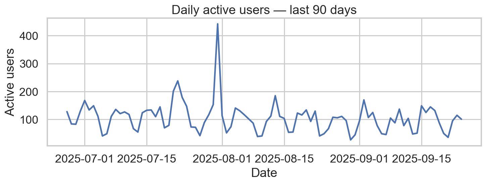
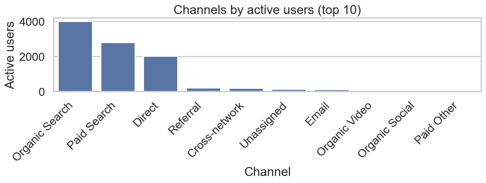
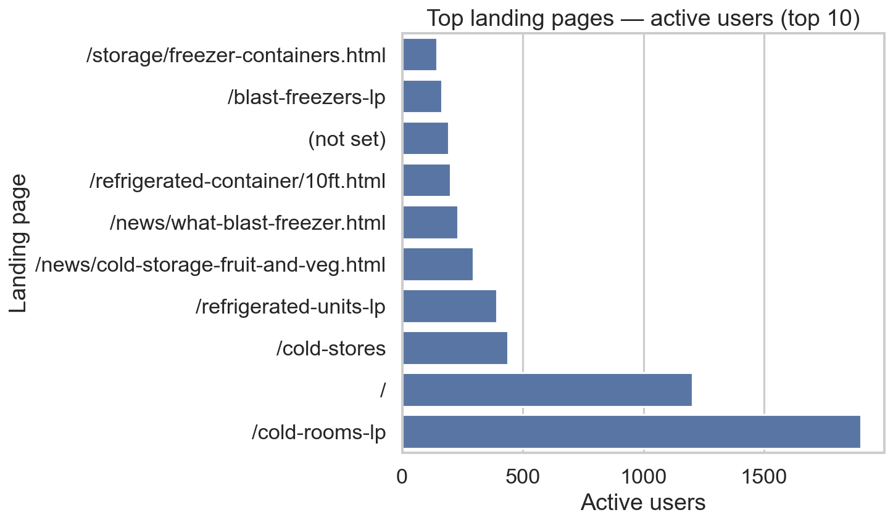
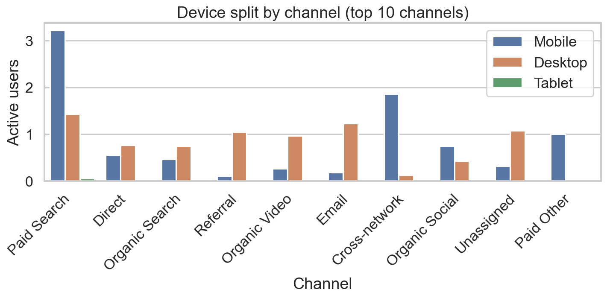

# GA4 Landing Page & Channel Insights — last 90 days
_Data window: **2025-06-27 → 2025-09-24** (from CSV)_

**Overview** • Active users (sum): **9,534**

## Channels — Active users
| Channel | Active users |
|---|---:|
| Organic Search | 4,003 |
| Paid Search | 2,795 |
| Direct | 2,022 |
| Referral | 205 |
| Cross-network | 189 |
| Unassigned | 128 |
| Email | 119 |
| Organic Video | 37 |
| Organic Social | 33 |
| Paid Other | 3 |

## Top landing pages — Active users
| Landing page | Active users |
|---|---:|
| /cold-rooms-lp | 1,903 |
| / | 1,203 |
| /cold-stores | 438 |
| /refrigerated-units-lp | 392 |
| /news/cold-storage-fruit-and-veg.html | 294 |
| /news/what-blast-freezer.html | 230 |
| /refrigerated-container/10ft.html | 201 |
| (not set) | 194 |
| /blast-freezers-lp | 164 |
| /storage/freezer-containers.html | 145 |
| /refrigerated-container/40ft.html | 137 |
| /get-in-touch-with-crs | 131 |
| /blast-freezer | 118 |
| /refrigerated-container/20ft.html | 98 |
| /enquiry | 85 |